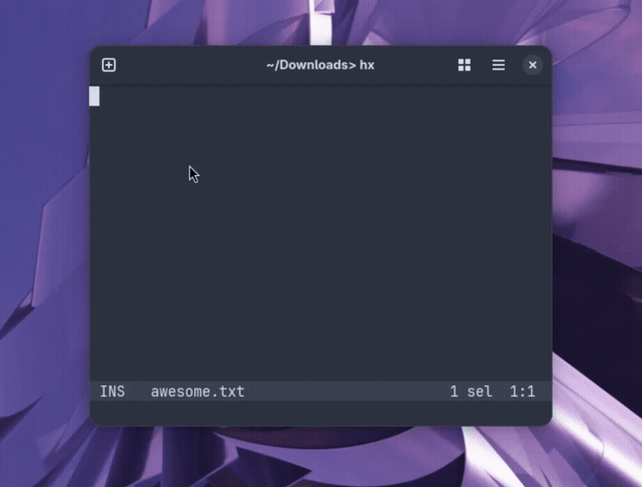

# Redpen language server



An implementation of the [Language Server Protocol](https://microsoft.github.io/language-server-protocol/) (LSP) designed to serve as the missing spell checker for code editors such as VSCode, Vim, Helix, and other editors that support LSP. It underlines misspelled words and suggests potential corrections using [Hunspell](https://github.com/hunspell/hunspell).

# Installation

Simply downloading the main.py file and symlinking or moving it to a directory in your $PATH is sufficient.

```
$ git clone https://github.com/ymcx/redpen-lsp
$ ln -s $PWD/redpen-lsp/main.py $HOME/.local/bin/redpen.py
```

# Setup

Before running it for the first time, you'll need to install Hunspell and locate the dictionary folder along with the filename of the dictionary for your preferred language.

By default, these are set to "/usr/share/hunspell" and "de_DE". If you want to override these, you can set them by passing either the location (/usr/share/hunspell) or both the location and preferred language (/usr/share/hunspell de_DE) to the server.

```
$ redpen.py /usr/share/hunspell de_DE
```

Languages can also be overridden on a file-by-file basis by adding a line at the top of the file containing a # followed by the preferred language (de_DE), separated by a space.

```
$ cat myfile.txt
# de_DE
Ich bin ein Hund. Nein, bin ich nicht.
```

### Helix

```
$ cat ~/.config/helix/languages.toml
[language-server.redpen]
command = "redpen.py"
args = ["/usr/share/hunspell", "de_DE"]

[[language]]
name = "text"
scope = "source.text"
file-types = ["txt", "md"]
language-servers = ["redpen"]
soft-wrap.enable = true
```
